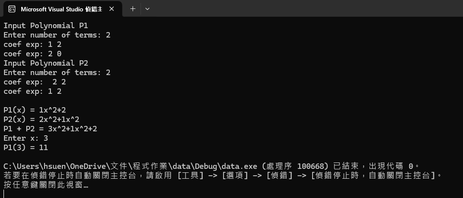

# 41343126

作業三

## Problem : Circular Linked List

#### 問題分析:

實作一個 **多項式（Polynomial）抽象資料型態（ADT）**。
 
**使用循環鏈結串列（Circular Linked List）** 搭配 **自訂 Iterator** 來表示多項式，  

---

## 解題思路與策略

### 1. 多項式資料表示

數學上的多項式定義為：

$P(x) = a_0 + a_1x + a_2x^2 + \cdots + a_nx^n$

每一項多項式以 `(coef, exp)` 形式儲存：

| 係數 (coef) | 次方 (exp) |
|-----------|-----------|
| 3         | 2         |
| 5         | 1         |
| -7        | 0         |

並使用 **循環鏈結串列（Circular Linked List）** 串接：

(3,2) → (5,1) → (-7,0)

↑________________↓

---

## 資料結構設計

### Term 結構（多項式的一項）

```
struct Term {
    double coef;
    int exp;

    Term(double c = 0, int e = 0) : coef(c), exp(e) {}
};
```

### ChainNode（鏈結串列節點）

```
template <class T>
class ChainNode {
public:
    T data;
    ChainNode<T>* link;

    ChainNode(const T& d = T(), ChainNode<T>* l = nullptr)
        : data(d), link(l) {}
};
```
### ChainIterator（串列走訪器）

```
template <class T>
class ChainIterator {
public:
    ChainNode<T>* current;

    ChainIterator(ChainNode<T>* p = nullptr) : current(p) {}

    T& operator*() const {
        return current->data;
    }

    ChainIterator<T>& operator++() {
        current = current->link;
        return *this;
    }

    bool operator!=(const ChainIterator<T>& rhs) const {
        return current != rhs.current;
    }
};

```
### Chain（循環鏈結串列）

```
template <class T>
class Chain {
public:
    typedef ChainNode<T> Node;
    Node* head;

    Chain() {
        head = new Node();      // dummy head
        head->link = head;     // circular
    }

    // 複製建構子（Deep Copy）
    Chain(const Chain& rhs) {
        head = new Node();
        head->link = head;
        Node* cur = rhs.head->link;
        while (cur != rhs.head) {
            InsertBack(cur->data);
            cur = cur->link;
        }
    }

    // 指派運算子（Deep Copy）
    Chain& operator=(const Chain& rhs) {
        if (this == &rhs) return *this;
        clear();
        Node* cur = rhs.head->link;
        while (cur != rhs.head) {
            InsertBack(cur->data);
            cur = cur->link;
        }
        return *this;
    }

    ~Chain() {
        clear();
        delete head;
    }

    void clear() {
        Node* cur = head->link;
        while (cur != head) {
            Node* tmp = cur;
            cur = cur->link;
            delete tmp;
        }
        head->link = head;
    }

    void InsertBack(const T& x) {
        Node* cur = head;
        while (cur->link != head)
            cur = cur->link;
        cur->link = new Node(x, head);
    }

    ChainIterator<T> Begin() const {
        return ChainIterator<T>(head->link);
    }

    ChainIterator<T> End() const {
        return ChainIterator<T>(head);
    }
};


```
### Polynomial 類別設計


```
class Polynomial {
private:
    Chain<Term> poly;

public:
    Polynomial() {}

    friend istream& operator>>(istream& in, Polynomial& p) {
        int n;
        cout << "請輸入項數：";
        in >> n;

        for (int i = 0; i < n; i++) {
            double c;
            int e;
            cout << "係數 次方：";
            in >> c >> e;
            if (c != 0)
                p.poly.InsertBack(Term(c, e));
        }
        return in;
    }

    friend ostream& operator<<(ostream& out, const Polynomial& p) {
        auto it = p.poly.Begin();
        auto end = p.poly.End();
        bool first = true;

        for (; it != end; ++it) {
            if (!first && (*it).coef > 0) out << "+";
            out << (*it).coef;
            if ((*it).exp > 0) out << "x";
            if ((*it).exp > 1) out << "^" << (*it).exp;
            first = false;
        }
        if (first) out << "0";
        return out;
    }

    Polynomial operator+(const Polynomial& rhs) const {
        Polynomial result;
        auto a = poly.Begin(), b = rhs.poly.Begin();
        auto aEnd = poly.End(), bEnd = rhs.poly.End();

        while (a != aEnd && b != bEnd) {
            if ((*a).exp == (*b).exp) {
                double c = (*a).coef + (*b).coef;
                if (c != 0)
                    result.poly.InsertBack(Term(c, (*a).exp));
                ++a; ++b;
            } else if ((*a).exp > (*b).exp) {
                result.poly.InsertBack(*a++);
            } else {
                result.poly.InsertBack(*b++);
            }
        }

        while (a != aEnd) result.poly.InsertBack(*a++);
        while (b != bEnd) result.poly.InsertBack(*b++);

        return result;
    }

    double Evaluate(double x) const {
        double sum = 0;
        for (auto it = poly.Begin(); it != poly.End(); ++it)
            sum += (*it).coef * pow(x, (*it).exp);
        return sum;
    }
};

```

### 程式碼

```
#include <iostream>
#include <cmath>
using namespace std;

/*==============================
  ChainNode
==============================*/
template <class T>
class ChainNode {
public:
    T data;
    ChainNode<T>* link;

    ChainNode(const T& d = T(), ChainNode<T>* l = nullptr)
        : data(d), link(l) {}
};

/*==============================
  ChainIterator
==============================*/
template <class T>
class ChainIterator {
public:
    ChainNode<T>* current;

    ChainIterator(ChainNode<T>* p = nullptr) : current(p) {}

    T& operator*() const {
        return current->data;
    }

    ChainIterator<T>& operator++() {
        current = current->link;
        return *this;
    }

    bool operator!=(const ChainIterator<T>& rhs) const {
        return current != rhs.current;
    }
};

/*==============================
  Chain (Circular Linked List)
==============================*/
template <class T>
class Chain {
public:
    typedef ChainNode<T> Node;
    Node* head;

    /* Constructor */
    Chain() {
        head = new Node();
        head->link = head;
    }

    /* Copy Constructor (DEEP COPY) */
    Chain(const Chain& rhs) {
        head = new Node();
        head->link = head;

        Node* cur = rhs.head->link;
        while (cur != rhs.head) {
            InsertBack(cur->data);
            cur = cur->link;
        }
    }

    /* Assignment Operator (DEEP COPY) */
    Chain& operator=(const Chain& rhs) {
        if (this == &rhs) return *this;

        clear();

        Node* cur = rhs.head->link;
        while (cur != rhs.head) {
            InsertBack(cur->data);
            cur = cur->link;
        }
        return *this;
    }

    /* Destructor */
    ~Chain() {
        clear();
        delete head;
    }

    void clear() {
        Node* cur = head->link;
        while (cur != head) {
            Node* tmp = cur;
            cur = cur->link;
            delete tmp;
        }
        head->link = head;
    }

    bool IsEmpty() const {
        return head->link == head;
    }

    void InsertBack(const T& x) {
        Node* cur = head;
        while (cur->link != head)
            cur = cur->link;
        cur->link = new Node(x, head);
    }

    ChainIterator<T> Begin() const {
        return ChainIterator<T>(head->link);
    }

    ChainIterator<T> End() const {
        return ChainIterator<T>(head);
    }
};

/*==============================
  Polynomial Term
==============================*/
struct Term {
    double coef;
    int exp;

    Term(double c = 0, int e = 0) : coef(c), exp(e) {}
};

/*==============================
  Polynomial
==============================*/
class Polynomial {
private:
    Chain<Term> poly;

public:
    Polynomial() {}

    /* Input */
    friend istream& operator>>(istream& in, Polynomial& p) {
        int n;
        cout << "Enter number of terms: ";
        in >> n;

        for (int i = 0; i < n; i++) {
            double c;
            int e;
            cout << "coef exp: ";
            in >> c >> e;
            if (c != 0)
                p.poly.InsertBack(Term(c, e));
        }
        return in;
    }

    /* Output */
    friend ostream& operator<<(ostream& out, const Polynomial& p) {
        auto it = p.poly.Begin();
        auto end = p.poly.End();
        bool first = true;

        for (; it != end; ++it) {
            if (!first && (*it).coef > 0) out << "+";
            out << (*it).coef;
            if ((*it).exp > 0) out << "x";
            if ((*it).exp > 1) out << "^" << (*it).exp;
            first = false;
        }
        if (first) out << "0"; // empty polynomial
        return out;
    }

    /* Polynomial Addition */
    Polynomial operator+(const Polynomial& rhs) const {
        Polynomial result;

        auto a = poly.Begin();
        auto b = rhs.poly.Begin();
        auto aEnd = poly.End();
        auto bEnd = rhs.poly.End();

        while (a != aEnd && b != bEnd) {
            if ((*a).exp == (*b).exp) {
                double c = (*a).coef + (*b).coef;
                if (c != 0)
                    result.poly.InsertBack(Term(c, (*a).exp));
                ++a; ++b;
            }
            else if ((*a).exp > (*b).exp) {
                result.poly.InsertBack(*a);
                ++a;
            }
            else {
                result.poly.InsertBack(*b);
                ++b;
            }
        }

        while (a != aEnd) {
            result.poly.InsertBack(*a);
            ++a;
        }
        while (b != bEnd) {
            result.poly.InsertBack(*b);
            ++b;
        }

        return result;
    }

    /* Evaluate */
    double Evaluate(double x) const {
        double sum = 0;
        for (auto it = poly.Begin(); it != poly.End(); ++it)
            sum += (*it).coef * pow(x, (*it).exp);
        return sum;
    }
};

/*==============================
  Main (Test)
==============================*/
int main() {
    Polynomial p1, p2;

    cout << "Input Polynomial P1\n";
    cin >> p1;

    cout << "Input Polynomial P2\n";
    cin >> p2;

    cout << "\nP1(x) = " << p1 << endl;
    cout << "P2(x) = " << p2 << endl;

    Polynomial sum = p1 + p2;
    cout << "P1 + P2 = " << sum << endl;

    double x;
    cout << "Enter x: ";
    cin >> x;
    cout << "P1(" << x << ") = " << p1.Evaluate(x) << endl;

    return 0;
}

```

### 效能分析

| 操作      | 時間複雜度    | 空間複雜度    | 說明    |
| ------- | -------- | -------- | ----- |
| 輸入 / 輸出 | O(n)     | O(n)     | 逐項處理  |
| 多項式加法   | O(n + m) | O(n + m) | 合併兩串列 |
| 求值      | O(n)     | O(1)     | 逐項計算  |

### 測試與驗證


### 申論及開發報告

**(1) 專案摘要**

本專案實作一個 **多項式（Polynomial）類別**，以物件導向方式模擬數學上的多項式結構。

目標是透過 **ADT** 與 **封裝** 的概念，建立可以進行多項式運算的類別，並利用 **多載** 使多項式操作自然化，例如：

```
Polynomial sum = p1 + p2;
cout << "P(x) = " << sum;
```

實作重點如下：

根據題目提供之ADT與private data members設計類別。

使用 循環鏈結串列或動態陣列來儲存多項式各項。

重載 >> 與 << 運算子以進行多項式的輸入與輸出。

實作多項式加法、減法、乘法以及求值方法。

**(2) 系統設計與類別架構**

| Polynomial                          |
| ----------------------------------- |
| - degree : int                      |
| - coef : double*                    |
| + Polynomial(int deg=0)             |
| + Polynomial(const Polynomial&)     |
| + ~Polynomial()                     |
| + operator=(const Polynomial&)      |
| + operator>>(istream&, Polynomial&) |
| + operator<<(ostream&, Polynomial&) |
| + operator+(const Polynomial&)      |
| + operator-(const Polynomial&)      |
| + operator*(const Polynomial&)      |
| + evaluate(double x): double        |

**(3) 心得與反思**

抽象資料型態（ADT）實作

將抽象概念轉化為可執行類別，確保資料封裝與接口完整性。

ADT 設計有助於程式結構化，降低錯誤發生率。

運算子多載的重要性

讓物件操作更自然，例如 p1 + p2 表示多項式加法。

增加程式可讀性與維護性。

**記憶體管理**

使用動態陣列或鏈結串列時，必須注意深拷貝與釋放。

避免物件之間共用指標導致資料錯誤或洩漏。

**效率考量**

使用 Horner’s Method 計算多項式可降低運算次數，提高效率。

循環鏈結串列方便插入、刪除，但隨機存取效率低，適合項數中等的多項式。
